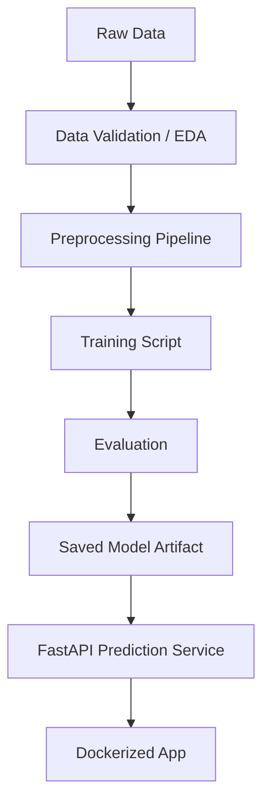

# ML Prediction Service

This repository contains a production-style machine learning prediction service built as Phase 1 of my AI Engineering roadmap.

## Project Goal

Build an end-to-end ML system that goes beyond notebook-based modeling.

The system will include:

- Dataset exploration
- Data preprocessing
- Baseline model training
- Model evaluation
- Model artifact saving
- FastAPI prediction service
- Dockerized deployment
- Logging
- Basic monitoring notes
- Tests
- Documentation

## Why This Project Matters

The goal is to practice ML Engineering fundamentals:

- Reproducibility
- Maintainable project structure
- Training-serving consistency
- API-based model serving
- Evaluation and error analysis
- Deployment readiness
- Documentation quality

## Planned Architecture



## Current Status

Status: Not Started

## Tech Stack

Planned:

- Python
- scikit-learn
- pandas
- numpy
- FastAPI
- Uvicorn
- Docker
- pytest
- GitHub Actions

## Folder Structure

Planned:

```text
ml-prediction-service/
├── data/
├── notebooks/
├── src/
│   ├── data/
│   ├── features/
│   ├── models/
│   ├── api/
│   └── utils/
├── tests/
├── artifacts/
├── reports/
├── Dockerfile
├── docker-compose.yml
├── requirements.txt
└── README.md
```

## Roadmap

- [ ] Select dataset
- [ ] Define ML problem
- [ ] Create EDA notebook
- [ ] Build preprocessing pipeline
- [ ] Train baseline model
- [ ] Evaluate model
- [ ] Save model artifact
- [ ] Create FastAPI app
- [ ] Add Docker support
- [ ] Add tests
- [ ] Write final report
- [ ] Tag v1.0 release

## Linked Roadmap

Main roadmap repository: [ai-engineering-roadmap](https://github.com/Harper2123/ai-engineering-roadmap).
